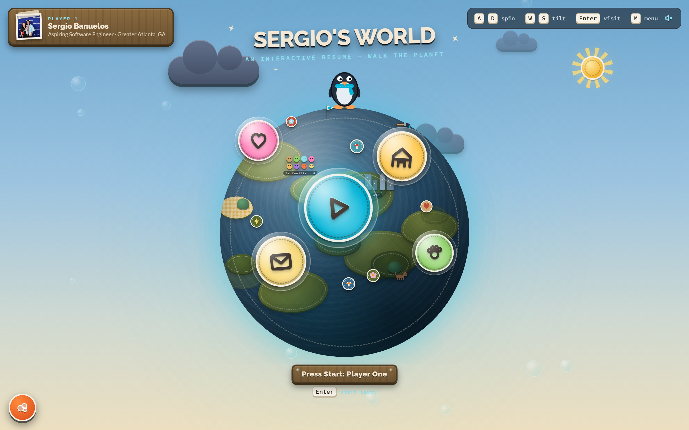
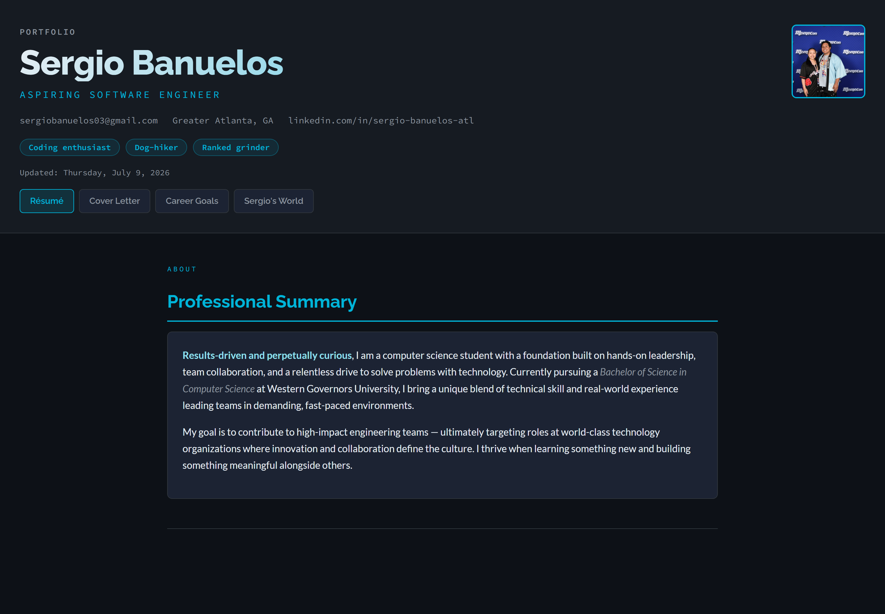
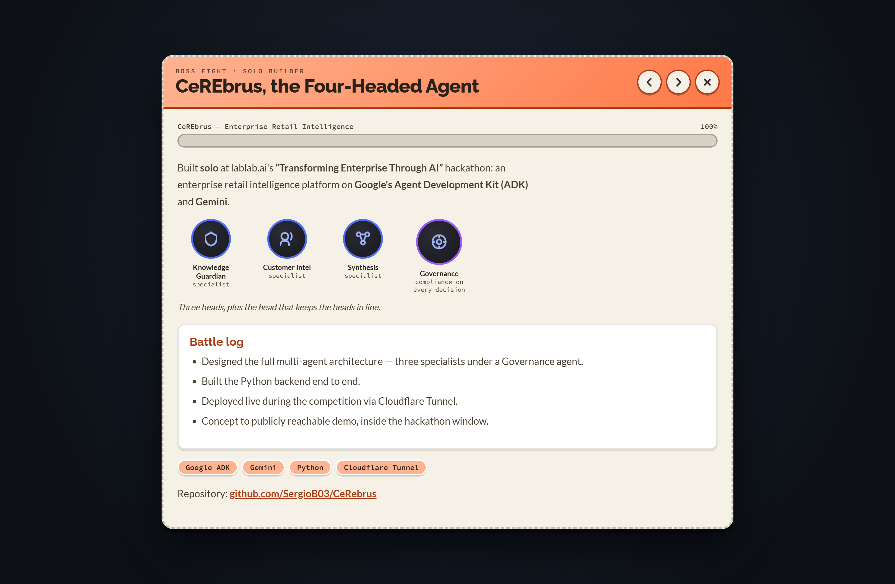

<div align="center">

# Sergio's World — An Interactive Résumé

**A portfolio that isn't a document. It's a planet you walk.**

A framework‑free personal portfolio for **Sergio Banuelos**, Aspiring Software Engineer.
Built with nothing but **HTML, CSS, and vanilla JavaScript** — no React, no build step, no dependencies.

[](https://sergiob03.github.io/resume-v2/)
&nbsp;
[](https://sergiob03.github.io/resume-v2/resume.html)


<br />



</div>

---

## 🔗 Links

| | |
|---|---|
| **🌍 Live site (share this)** | **https://sergiob03.github.io/resume-v2/** |
| **📄 Classic résumé** | https://sergiob03.github.io/resume-v2/resume.html |
| **💻 Source code** | https://github.com/SergioB03/resume-v2 |

> The **live site link** is the one to put on a résumé, LinkedIn, or send to a recruiter — it opens in any browser, no install required. The **source code link** is for people who want to see how it's built.

---

## What is this?

Two portfolios in one repository, sharing the same content and personality:

### 🕹️ Sergio's World — the interactive résumé
A **LittleBigPlanet‑inspired** experience where your career is a little planet. You spin a hand‑stitched felt globe, walk a penguin avatar across it, and step into glowing "level" stickers — each one a job, a project, or a chapter of the story. Every pixel is drawn in CSS; the globe's 3‑D projection, the penguin's waddle, and the day/night sky are all plain JavaScript.

### 📄 The classic résumé
For recruiters and ATS systems that just want the facts, the same content lives in a clean, accessible, dark‑themed multi‑page site: **Résumé → Cover Letter → Career Goals**.

<div align="center">

| The classic résumé | An opened "level" |
|:---:|:---:|
|  |  |
| Semantic, accessible, ATS‑friendly | Each planet sticker opens a themed card |

</div>

---

## ✨ Features

- **A 3‑D felt planet, all in CSS/JS** — landmasses, props, and level markers are positioned on a sphere by a hand‑written 3‑D projection every frame. No WebGL, no libraries.
- **A drivable penguin avatar** — waddles, flaps, and turns to face its direction of travel; its walk speed tracks how fast you spin the globe.
- **Nine levels** — one for each part of the story (see the map below), each opening into a themed "prize bubble" card with its own color and layout.
- **Day / night sky** — the background follows the visitor's real clock: paper moon and shooting stars at night, a cardboard sun and drifting clouds by day.
- **A Pop‑It menu** — an in‑world skills‑and‑contact panel, straight out of the LBP playbook.
- **Full keyboard, mouse, and touch controls** — `A`/`D` to spin, `W`/`S` to tilt, `Enter` to visit a level; drag to spin; on‑screen D‑pad on phones.
- **Accessible by design** — semantic landmarks, ARIA labels on every level, focus management, `inert` backgrounds behind dialogs, screen‑reader announcements, and a full non‑JavaScript fallback.
- **Progressive enhancement** — scroll‑reveal and interactivity layer on top of content that works with JavaScript disabled.
- **Zero dependencies** — no framework, no bundler, no `npm install`. Open the file and it runs.

### 🗺️ The world map

| Level | Represents |
|---|---|
| **Press Start** | Intro — who Sergio is |
| **World 1‑1 · The Scaffold Yard** | Construction Foreman @ KS Pro Painters |
| **World 1‑2 · Chattahoochee Pack Run** | Dog Walker & Trail Guide |
| **World 2 · The Skill Tree** | B.S. Computer Science @ WGU |
| **Side Quest · DineroClaro** | Bilingual financial‑literacy app (VibraATL hackathon) |
| **Ranked Match · Valorant Analyzer** | AI mental‑game coach (in development) |
| **Boss Fight · CeREbrus** | Solo‑built multi‑agent enterprise AI platform |
| **Home Base · McDonough, GA** | Life beyond the code |
| **New Game+ · Contact** | Goals & how to reach out |

---

## 🛠️ Built with

- **HTML5** — semantic, accessible markup
- **CSS3** — custom properties, gradients, `clip-path`, keyframe animation, container‑free responsive layout (no framework)
- **Vanilla JavaScript** — 3‑D projection math, an input/state machine, `IntersectionObserver` scroll‑reveal, Web Audio blips
- **Google Fonts** — Raleway, Lato, Source Code Pro
- **Formspree** — contact‑form handling (with a `mailto:` fallback)

---

## 📁 Project structure

```
resume-v2/
├── index.html          # Landing → redirects to Sergio's World
├── resume-world.html   # 🕹️ The interactive planet (self-contained: HTML + CSS + JS)
├── resume.html         # 📄 Classic résumé
├── cover-letter.html   # 📄 Cover letter
├── career-goals.html   # 📄 Career goals, gallery, contact form
├── master.css          # Shared stylesheet for the classic pages
├── media/              # Photos, project screenshots, intro audio/video
└── docs/screenshots/   # Images used in this README
```

---

## 🚀 Run it locally

No build tools required — it's a static site.

```bash
# 1. Clone
git clone https://github.com/SergioB03/resume-v2.git
cd resume-v2

# 2. Serve it (any static server works). For example:
python -m http.server 8000
#   → then open http://localhost:8000

# …or just double-click index.html to open it straight in a browser.
```

> A local server is recommended over opening the file directly so the audio/video and fonts load cleanly.

---

## 🧩 Featured projects (shown inside the résumé)

- **CeREbrus** — an enterprise retail‑intelligence platform of four coordinated AI agents (Google ADK + Gemini), **built solo and deployed live** during a lablab.ai hackathon. → [github.com/SergioB03/CeRebrus](https://github.com/SergioB03/CeRebrus)
- **Valorant Performance Analyzer** — a full‑stack AI coach for the *mental* side of competitive play (React, Python, Claude API, Riot API, RAG). *In development.*
- **DineroClaro** — a bilingual financial‑literacy mobile app for Atlanta's underserved Hispanic community, built at the VibraATL hackathon at Georgia State University. → [github.com/ullahasmat/DineroClaro](https://github.com/ullahasmat/DineroClaro)

---

## 📜 Credits & license

All code, written content, and project screenshots are the original work of **Sergio Banuelos**.

- **Stock imagery** in the "Beyond the Code" gallery is served from [LoremFlickr](https://loremflickr.com) under Creative Commons, stored locally for illustrative use.
- **Typefaces** (Raleway, Lato, Source Code Pro) are used under the SIL Open Font License via [Google Fonts](https://fonts.google.com).

This is a personal portfolio. You're welcome to read the code and learn from it — please don't republish the written content, personal media, or likeness as your own.

---

## 📬 Contact

**Sergio Banuelos** · Aspiring Software Engineer · Greater Atlanta, GA

[](mailto:sergiobanuelos03@gmail.com)
[](https://www.linkedin.com/in/sergio-banuelos-atl)

<div align="center">
<br />
<em>Built from scratch. No frameworks were harmed in the making of this résumé.</em>
</div>
